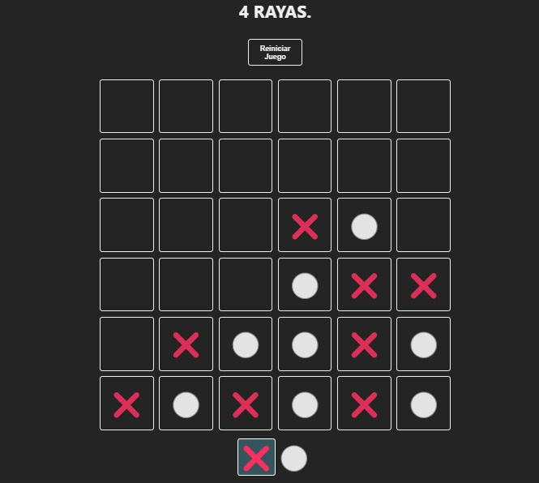

# 4 en Línea - Juego de Estrategia

Este proyecto es una implementación del clásico juego de mesa 4 en Línea desarrollado con React y Vite. El juego consiste en colocar fichas en un tablero verticalmente, con el objetivo de formar una línea de cuatro fichas del mismo color de manera horizontal, vertical o diagonal.

## Cómo Jugar

1. Abre el enlace al juego.
2. Al comienzo del juego, se te asignará un turno para colocar una ficha en el tablero.
3. Haz clic en una columna en la que desees colocar tu ficha.
4. El juego alternará automáticamente entre los turnos de los jugadores.
5. El primer jugador en formar una línea de cuatro fichas de su color gana la partida.
6. Si todas las casillas del tablero se llenan sin que ningún jugador forme una línea de cuatro fichas, la partida termina en empate.

## Acceso al Juego

Puedes acceder al juego desplegado [aquí]([https://symphonious-bombolone-c3f67a.netlify.app/](https://65cf91f842db570008d866fe--symphonious-bombolone-c3f67a.netlify.app/)).

## Basado en un Repositorio de Midudev

Este juego está basado en una copia del repositorio de [midudev](https://github.com/midudev/coders-tic-tac-toe), quien proporcionó la base del juego de Tic-Tac-Toe que fue adaptada y extendida para crear esta versión de 4 en Línea.

## Plugins de Vite para React

Este proyecto utiliza Vite como su herramienta de construcción, junto con el plugin oficial de React. Puedes elegir entre dos plugins para habilitar Fast Refresh:

- [@vitejs/plugin-react](https://github.com/vitejs/vite-plugin-react/blob/main/packages/plugin-react/README.md): Utiliza Babel para Fast Refresh.
- [@vitejs/plugin-react-swc](https://github.com/vitejs/vite-plugin-react-swc): Utiliza SWC para Fast Refresh.

Elige el que mejor se adapte a tus necesidades de desarrollo.

